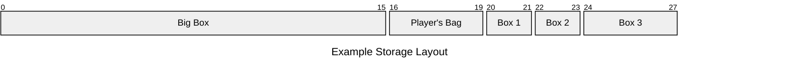
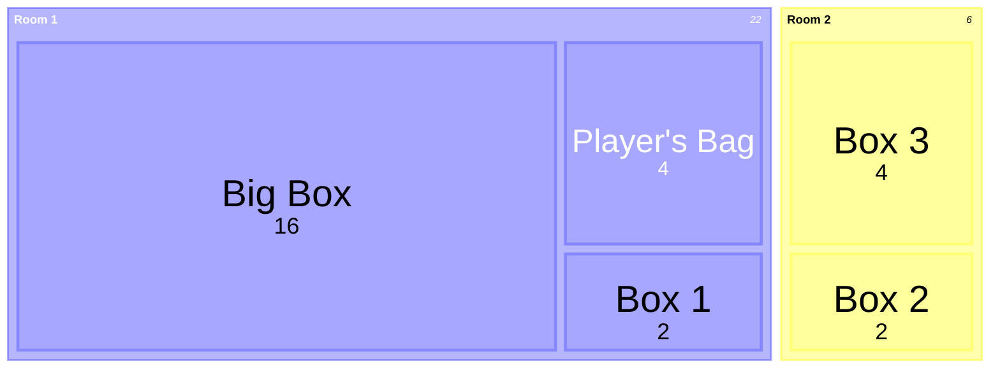

# Buffer Overflow

## Basic Idea

* When the player tries to put `X` items into a container that can only hold `Y`
  items (`X > Y`), the last `X - Y` item would "overflow" into the next
  containers, whatever they are.
* When dumping a container with capacity `Y` but "believes" it has `X` items
  (`X > Y`), the last `X - Y` item would come from the next containers
* When players transfers items one by one (e.g. drag & drop), everything works
  as expected.
* But when the use the "Take All", "Dump All" buttons/actions, that's when the
  "bug" kicks in.

## Implementation

The game world uses a **single backing array** to represent all item storage.
Each container is defined by a fixed subrange of that array
(`startIndex..endIndex`) and maintains a `count` of how many items it *thinks*
it holds. Crucially, `count` can diverge from reality: it can exceed the
container’s physical capacity, go negative, or ignore items actually in its
range. This mismatch is what creates “overflow bugs.”

### Data Model

* **Backing Array** - a single `Item[]` that holds every item slot in the level.
* **Container** - defined by:
    * `startIndex, endIndex` -> subrange in the backing array.
    * `count` -> logical number of items it believes it holds. May not match
      reality.
* **Overflow Graph** - defines the order in which containers spill into one
  another (e.g. Bag → Box1 → Box2). This order is fixed per level and gives
  overflow its “bug-like” feel.

### Actions

#### Take All / Dump All

When taking/dumping, the operation iterates based on the *container’s count*,
not just its physical slots:

1. Start from the source container.
2. For each item the source *claims* to have (`for i in 0..source.count`):
    * Look for the next occupied slot in source’s subrange.
    * If none found, follow the overflow graph into the next container’s range.
    * Move that item into the first available slot in the destination.
    * If the destination has no free slot left in its subrange, follow the
      overflow graph into the next container.
3. Destination increments its `count` by the full `source.count`.
4. Source resets its `count` to zero.
5. Items may have been pulled or pushed from containers the player cannot
   normally access — this is how overflow exposes hidden states.

#### Transfer (Drag & Drop)

* Drag one item from a visible slot in source to a visible free slot in
  destination.
* Updates both `count` values by ±1.
* Overflow is not involved.

#### Swap

* Drop onto an occupied slot: exchange the two items.
* Counts do not change. Nor is overflow involved.

### Overflow Mechanics

When a container’s `count` exceeds its range capacity:

* **Extra items are written into the next container in the overflow graph.**
* Those containers may remain unaware (`count` unchanged) — which allows
  "phantom" items to accumulate.

### Consequences

* **Phantom storage:** A container may think it is empty, while its backing
  range is filled with overflowed items.
* **Leaking state:** Items can slip into otherwise inaccessible containers.
* **Exfiltration:** By dumping more items than you truly had, you can pull from
  containers beyond your reach.
* **Null items:** If a dump goes past the last container in the chain, a special
  `null` placeholder can be created. This can trigger unique puzzle mechanics
  (e.g. corruption, rules rewrites).

---

This implementation deliberately embraces **mismatched truth vs belief**
(`count` vs actual contents). That mismatch is what simulates buffer overflow
behavior and allows puzzle exploits like unlocking hidden containers, leaking
rules, or pulling data from unreachable memory.

## Item Types

* **Tags** - Does nothing on its own, but may trigger actions of containers.
* **Numbers** - Participates in arithmetic operations.
* **Physical Objects** - Can be instantiated in the scene.
* **Weights** - Can add weigths to the container and enable interactions with
  pressure plates.

## Example

Suppose the level starts with 7 items (*A-G*) in the *Big Box* and 1 item (*H*)
in *Box 3*. Player can directly access the *Big Box* and *Box 1*, but not
*Box 2* or *Box 3* (assume there is a wall in between).

| Container | Big Box       | Player's Bag | Box 1 | Box 2 | Box 3 |
|-----------|---------------|--------------|-------|-------|-------|
| Items     | A,B,C,D,E,F,G |              |       |       | H     |
| Count     | 7             | 0            | 0     | 0     | 1     |

### Putting Items into Inaccessable Containers

If the player tries to "Take All" from the *Big Box*, the *Big Box* would
would be left with no items. Meanwhile *Player's Bag* **thinks** it has all 7
items, but in reality it only has 4 (*A-D*), while *E,F* overflows into *Box 1*
and *G* into *Box 2*. Both *Box 1* and *Box 2* still thinks they are empty.

| Container | Big Box | Player's Bag | Box 1 | Box 2 | Box 3 |
|-----------|---------|--------------|-------|-------|-------|
| Items     |         | A,B,C,D      | E,F   | G     | H     |
| Count     | 0       | 7            | 0     | 0     | 1     |

Using this method player can put items into *Box 1* and *Box 2*, even if *Box 2*
isn't directly accessable. *Box 2* can be a trigger-type container which
performs an action when any or a specific item is placed inside.

If the player now "Dumps All" items to the *Big Box*, we would be back to the
initial state. But that's not fun so let's try something else.

### Taking Items from Inaccessable Containers

First, player manually puts 2 items (*A,B*) back to the *Big Box*.

| Container | Big Box | Player's Bag | Box 1 | Box 2 | Box 3 |
|-----------|---------|--------------|-------|-------|-------|
| Items     | A,B     | C,D          | E,F   | G     | H     |
| Count     | 2       | 5            | 0     | 0     | 1     |

Second, player manually takes 2 items (*E,F*) from *Box 1*. This is not the
"Take All" action.

| Container | Big Box | Player's Bag | Box 1 | Box 2 | Box 3 |
|-----------|---------|--------------|-------|-------|-------|
| Items     | A,B     | C,D,E,F      |       | G     | H     |
| Count     | 2       | 7            | -2    | 0     | 1     |

Finally, player "Dumps All" items into the *Big Box*.

1. *Player's Bag* thinks it has 7 items so it will try to dump that many.
2. Items *C,D,E,F* are dumped first. They are actually in *Player's Bag* so it's
  not surprising
3. *Player's Bag* still needs to dump 3 more items, so it looks into the next
  containers. There is a *G* in *Box 2* and an *H* in *Box 3*, both are getting
  dumped
4. *Player's Bag* still needs to dump 1 more item but we are out of containers.
  One option is to add a special *null* item which can be used in certain
  scenarios.
5. Now the player has gained access to item *H* which was previously in an
  inaccessable container.

| Container | Big Box              | Player's Bag | Box 1 | Box 2 | Box 3 |
|-----------|----------------------|--------------|-------|-------|-------|
| Items     | A,B,C,D,E,F,G,H,null |              |       |       |       |
| Count     | 9                    | 0            | -2    | 0     | 1     |

## Beyond the Last Container

When items overflow past the last container, instead of vanishing they can spill
into special sinks that change the game state.

* A **Null Sink** creates placeholder “null” items, useful as strange resources
  or corrupt clutter.
* A **Rules Container** corrupts gameplay logic, rewriting item behaviors or win
  conditions in unexpected ways.
* A **Scene Objects Container** directly alters the environment, spawning
  objects, toggling doors, or triggering world changes.

These sinks turn overflow into a puzzle mechanic, letting players exploit bugs
to bend both rules and reality.
